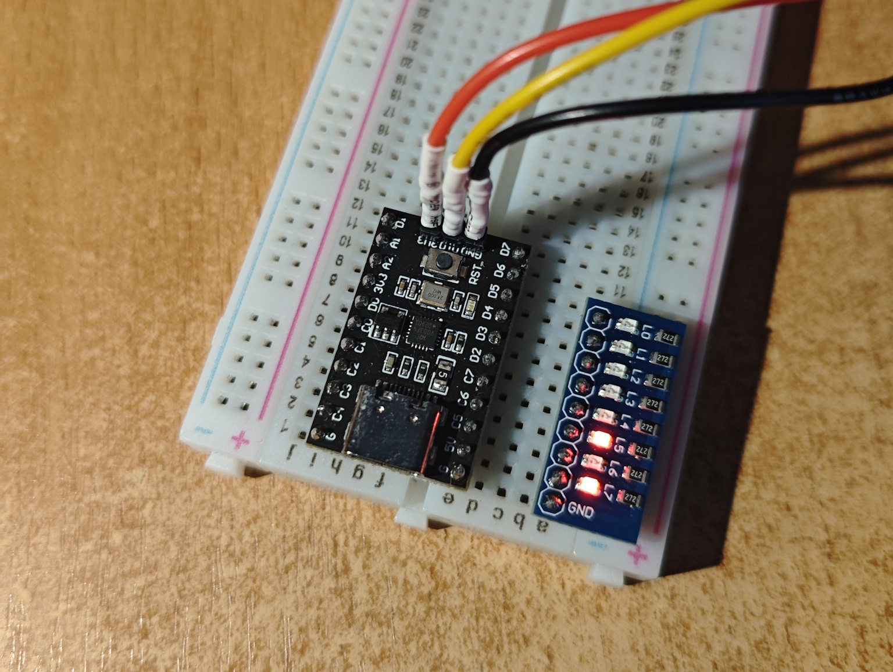

# Cooperative multitasking on CH32V003

This is a sample project that demonstrates cooperative threads on WCH CH32V003 microcontroller (RV32EC, 16KB Flash, 2KB RAM).

  
   
  Click to see the animation!

There are two threads: the first one blinks on pin C5 (eight times, with a 500ms period), and the second one blinks on pin C6 (forever, each second). Each thread has its own stack and can yield to the scheduler at any point.

It works by abusing `setjmp`/`longjmp` functions and swapping the stack pointer register. This can likely fail in a multitude of obscure and interesting ways, so use it at your own caution. But hey, it blinks!

## Building the project

This project assumes you have WCH versions of GCC and OpenOCD in your PATH environment variable.

### Windows

- Download and install the latest [MounRiver Studio release](https://www.mounriver.com/download).
- Add `C:\MounRiver\MounRiver_Studio2\resources\app\resources\win32\others\Build_Tools\Make\bin` to PATH.
- Add `C:\MounRiver\MounRiver_Studio2\resources\app\resources\win32\components\WCH\OpenOCD\OpenOCD\bin` to PATH.
- Add `C:\MounRiver\MounRiver_Studio2\resources\app\resources\win32\components\WCH\Toolchain\RISC-V Embedded GCC15\bin` to PATH.
- Run `make`.

### Linux

- Download the latest [MRS Toolchain](https://www.mounriver.com/download) and unpack it.
- Ensure you have `make` installed.
- Add `OpenOCD/OpenOCD/bin` to PATH.
- Add `Toolchain/RISC-V Embedded GCC15/bin` to PATH.
- Run `make`

## Flashing the project

Plug in your WCH-LinkE and run `openocd -f ./openocd.cfg -c program build/blink.elf reset exit`.

## Editor configuration

There is some preconfigured stuff for building and debugging through Visual Studio Code in `.vscode-samples` directory, you can copy it to `.vscode` and adapt to your environment.
